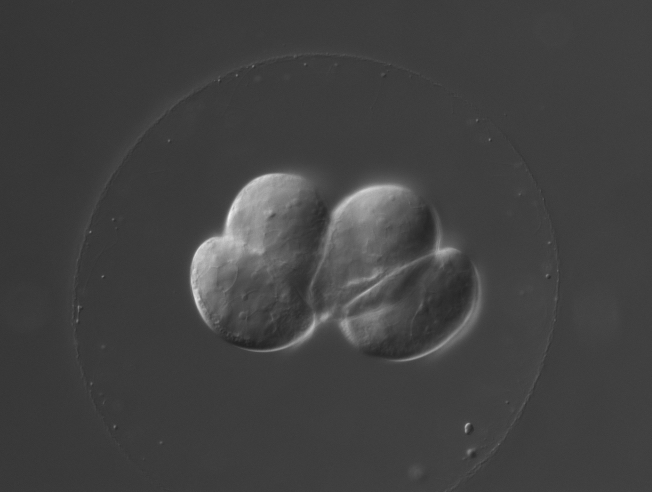
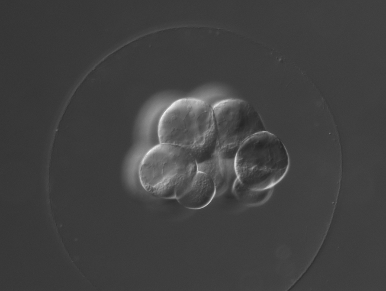
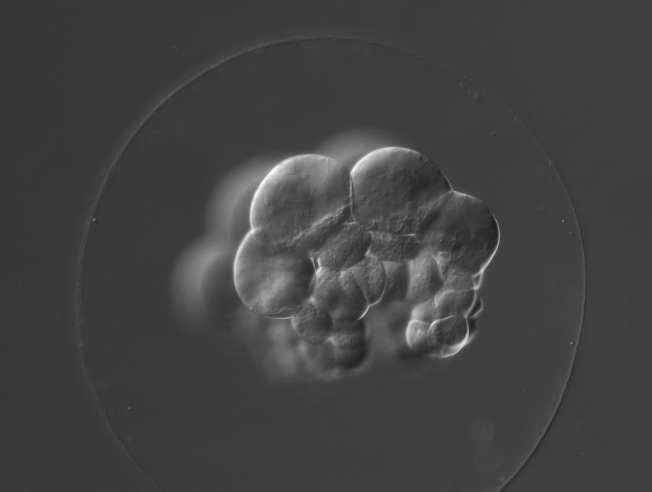
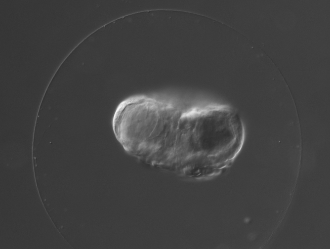
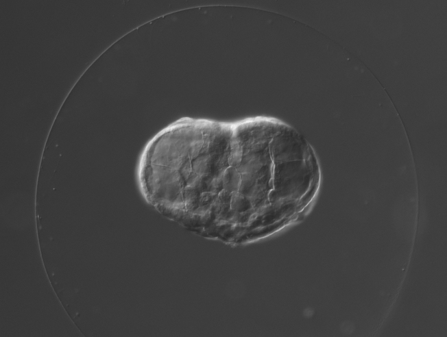
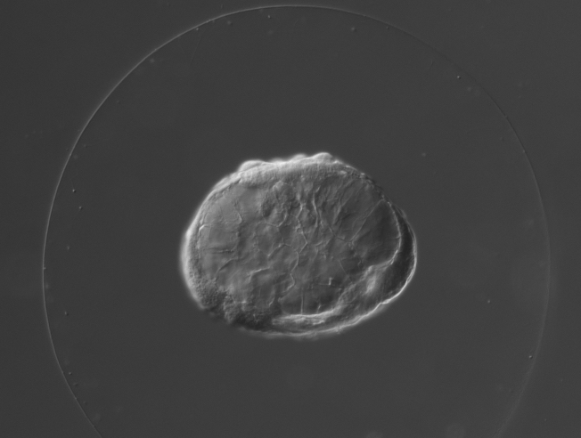
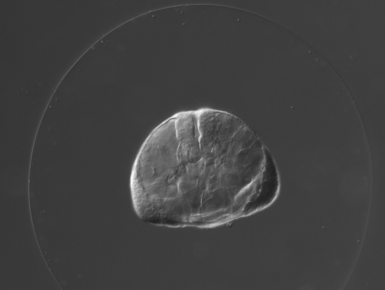

...Under Construction

For information about the exeriment click [here](experiment.html).


For how we built the transcriptome click [here](transcriptome.html).


For the quality control of our RNA-seq analysis click the following:

2 hour reference: 

  [all replicates](analysis2hpaAllR.html)
  
  [replicates removed](analysis2hpa2RR.Rmd)
  
8 hour reference:

  [all replicates](analysis8hpaAllR.html)
  [replicates removed](analysis8hpa5RR.html)

For our differential expression analysis click [here](StoryOfInitialAnalysis.html)

To download our data click [here](downloads.html).


Movies:

<iframe width="560" height="315" src="https://www.youtube.com/embed/k3RAbGtSxIc" frameborder="0" allowfullscreen></iframe>

Images of the embryogenesis:















```{r, eval = FALSE, echo = FALSE, results = 'asis'}

files <- list.files('images', pattern = 'timelapse', full.names = TRUE)

for (i in files){
  cat(paste0('\n'))
}

```